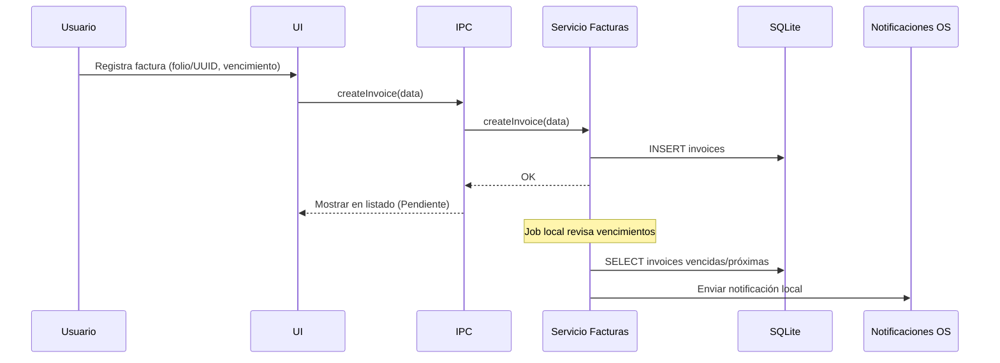
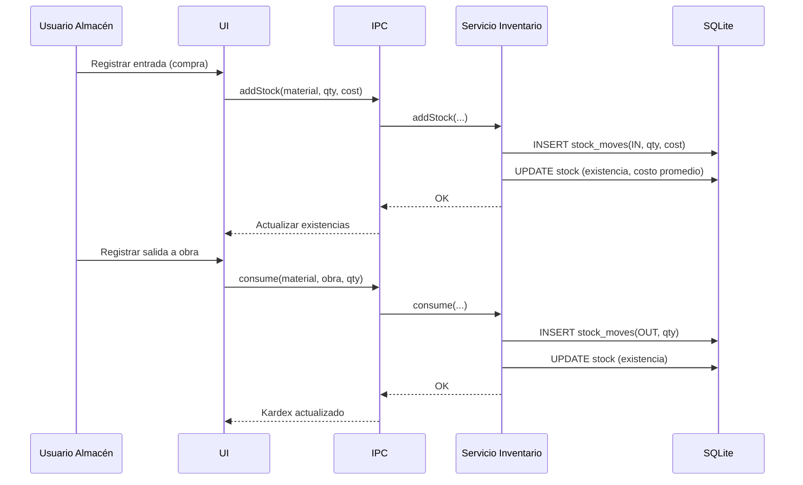
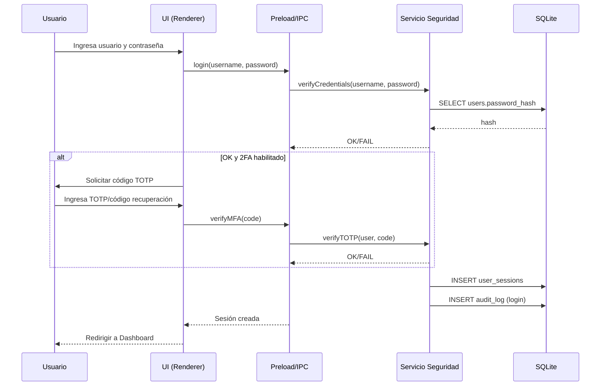

# Especificación de Software — Control de Gastos, Facturación y Materiales de Obra (Tamivar)

Fecha: 29/09/2025
Autor: Equipo de desarrollo
Estado: Propuesta inicial (v0.1)

## 1. Resumen ejecutivo
La empresa Tamivar enfrenta desorganización y falta de visibilidad en tres frentes clave: control de gastos, seguimiento de facturación y gestión de materiales de obra. El objetivo es implementar una aplicación de escritorio Windows (WinUI 3 / .NET) con base de datos local embebida (SQLite) y operación offline, que estructure procesos, centralice datos, facilite auditoría y reporte, y mejore la toma de decisiones.

## 2. Problemática (extraída del documento)
- No existe un sistema adecuado para el control de gastos: registros manuales, incompletos y poco confiables.
- Falta de claridad del origen, propósito y justificantes de cada desembolso.
- En facturación no hay mecanismo de seguimiento: difícil distinguir facturas emitidas vs pendientes; retrasos y omisiones.
- Gestión de materiales de obra sin registro sistemático: duplicidad de compras, desperdicio y pérdidas.
- Inconsistencias por la falta de integración entre áreas (administrativa/operativa) y demoras en comunicar información.
- Riesgos financieros/administrativos, afectación a la credibilidad, imagen poco profesional y menor competitividad.

## 3. Solución propuesta (síntesis)
Desarrollar un sistema integral local con:
- App de escritorio Windows con UI moderna basada en WinUI 3 (.NET 8) y operación offline-first.
- Base de datos SQLite embebida, accesible solo a través de la app.
- Módulos: Gastos, Facturación, Materiales, Proveedores, Proyectos/Obras, Reportes y Auditoría.
- Flujos con evidencia (fotos/PDF de comprobantes), estatus y aprobaciones.
- Roles/Permisos, bitácora de cambios, respaldos cifrados y controles de acceso.

## 4. Alcance
- Versión inicial (MVP) enfocada en: captura y control de gastos con justificantes, seguimiento básico de facturas, inventario de materiales con movimientos, reportes operativos.
- Datos locales en el equipo del usuario. Sin sincronización multi-dispositivo en v0.1 (extensible en roadmap).
- Sin timbrado fiscal CFDI en v0.1; se contemplan campos para registrar folios/estatus y anexar XML/PDF de terceros.

## 5. Objetivos
- Reducir errores y tiempos en registros administrativos (>50%).
- Aumentar la trazabilidad y auditoría (100% de operaciones con responsable, fecha y evidencia).
- Mejorar visibilidad de estatus de facturas y consumo de materiales.
- Proveer reportes para decisiones de compra y control presupuestal por obra.

## 6. Usuarios y roles
- Admin: configuración, usuarios, permisos, catálogos, respaldo/restauración.
- Contabilidad: gastos, facturas, reportes contables, conciliaciones.
- Gestoría: validación documental, seguimiento de trámites, revisión de facturas.
- Obra/Almacén: solicitud de compras, entradas/salidas de materiales, inventario.
- Dirección: panel ejecutivo y reportes.

## 7. Requisitos funcionales
### 7.0 Autenticación y sesión (Login)
- Inicio de sesión local offline con usuario/contraseña (sin dependencia de red).
- Opción "Recordarme" para sesión persistente (renovable) en el dispositivo.
- Política de contraseñas: mínimo 8 caracteres, al menos 1 mayúscula y 1 dígito.
- Bloqueo por intentos fallidos: después de 5 intentos, bloqueo temporal con backoff exponencial.
- 2FA opcional (TOTP) por usuario: activación con QR, verificación en login cuando esté habilitado.
- Códigos de recuperación (10) de un solo uso para acceso en caso de pérdida del 2FA.
- Cierre de sesión voluntario y cierre de todas las sesiones desde panel de cuenta.
- Gestión de sesiones activas por dispositivo (lista, revocación individual).
- Restablecimiento de contraseña local: mediante usuario administrador o mediante códigos de recuperación (sin email en v0.1).
- Auditoría: registrar inicios/cierres de sesión, cambios de contraseña, activación/desactivación de 2FA.

### 7.1 Gastos
- Capturar gasto con: fecha, obra/proyecto, categoría, proveedor, monto, forma de pago, centro de costo, descripción.
- Adjuntar comprobantes (foto/PDF/XML), validación de obligatoriedad según categoría.
- Flujo de estatus: Borrador → En revisión → Aprobado/Rechazado → Reembolsado/Contabilizado.
- Políticas: topes por categoría, obligatoriedad de justificación, validación de duplicados por folio/importe/fecha.
- Reportes: gastos por obra/categoría/periodo, vs presupuesto, gastos pendientes de aprobación/reembolso.

### 7.2 Facturación
- Registro de facturas: cliente/proveedor, serie/folio, fecha emisión, subtotal/IVA/total, UUID (si aplica), estatus (Pendiente/Emitida/Pagada/Cancelada), vencimiento.
- Adjuntos: XML/PDF (cuando exista). Validación de duplicados por UUID/folio.
- Seguimiento: listado por estatus, alertas de vencimiento (notificaciones locales).
- Relación con gastos/obras para trazabilidad.

### 7.3 Materiales de obra (Inventario)
- Catálogo de materiales (SKU, descripción, unidad, costo estándar, categoría).
- Entradas: compras/ajustes/iniciales; Salidas: consumo en obra, devoluciones.
- Kardex por material y por obra. Existencias por almacén/obra.
- Solicitudes de material y órdenes de compra simples (MVP).

### 7.4 Proyectos/Obras y Proveedores
- Obras: datos generales, responsables, presupuesto base, fechas, estado (Activa/Cerrada).
- Proveedores: razón social, RFC (opcional), contactos, condiciones de pago, documentos.

### 7.5 Reportes y paneles
- Gastos por obra/categoría/mes; facturas por estatus; consumo de materiales vs presupuesto.
- Exportación a CSV/PDF. Filtros y segmentación por fechas/obra/usuario.

### 7.6 Auditoría y bitácora
- Registro de operaciones (quién, qué, cuándo, antes/después para campos clave).
- Trazabilidad de adjuntos (hash/huella digital) para detectar cambios.

## 8. Requisitos no funcionales
- Rendimiento: operaciones comunes < 200 ms; listados paginados/virtualizados.
- Offline-first total; arranque sin red. Archivos adjuntos almacenados localmente.
- Seguridad: RBAC, cifrado de respaldos, hashes de contraseñas (Argon2/bcrypt), bloqueo de sesión.
- Confiabilidad: respaldo manual/automático programable; restauración validada.
- Usabilidad: interfaz en español, accesible (WCAG AA básico), atajos de teclado.
- Portabilidad: Windows 10/11 (x64); empaquetado e instalación con MSIX.

## 9. Arquitectura y tecnologías
- UI nativa: WinUI 3 (.NET 8 / Windows App SDK).
- Aplicación de escritorio: empaquetado MSIX; canal de actualización mediante MSIX/App Installer.
- Datos: SQLite (Microsoft.Data.Sqlite) con migraciones (DbUp/FluentMigrator). Adjuntos en filesystem en AppData local.
- Capa de acceso a datos: ORM/Query Builder (por ejemplo, Dapper o Entity Framework Core) con transacciones.
- Estado y UI: MVVM (CommunityToolkit.Mvvm); navegación y páginas (Frame/Page), estilos XAML.
- Integración con SO: notificaciones WinRT, almacenamiento seguro (Windows Credential Locker) para secretos.

### Diagramas de arquitectura y UML

Diagrama de arquitectura lógica (alto nivel):

```mermaid
flowchart LR
	U[Usuario] --> UI[WinUI 3 (.NET 8)]
	UI --> SVC[Servicios de Aplicación (MVVM/ViewModels)]
	SVC --> DAL[Capa de Datos (EF Core/Dapper)]
	DAL --> DB[(SQLite embebido)]
	SVC --> FS[Adjuntos (Filesystem AppData)]
	SVC --> BACKUP[Backups cifrados AES-256]
	UI --> AUTH[Sesión/RBAC]
```

Diagrama de componentes (módulos principales):

```mermaid
flowchart TB
	subgraph UI[WinUI 3 (XAML Views)]
		G[Gastos]
		F[Facturación]
		M[Materiales]
		P[Proyectos/Obras]
		V[Proveedores]
		R[Reportes]
		A[Auditoría/Backups]
	end
	UI --> VM[ViewModels (MVVM)]
	VM --> SVCG[Servicio Gastos]
	VM --> SVCF[Servicio Facturación]
	VM --> SVCM[Servicio Materiales]
	VM --> SVCCAT[Servicios Catálogos]
	VM --> SVCSEC[Servicio Seguridad]
	SVCG & SVCF & SVCM & SVCCAT & SVCSEC --> DAL2[(DAO/Migraciones)]
	DAL2 --> SQL[(SQLite)]
	SVCG & SVCF --> FILES[(Adjuntos)]
```

Secuencia: Captura de gasto con adjuntos y aprobación

```mermaid
sequenceDiagram
	participant U as Usuario
	participant UI as UI (Renderer)
	participant P as Preload/IPC
	participant S as Servicio Gastos (Main)
	participant DB as SQLite
	participant FS as Filesystem

	U->>UI: Completa formulario + adjunta archivos
	UI->>P: submitExpense(data, files)
	P->>S: submitExpense(data, files)
	S->>DB: BEGIN; INSERT expense...
	S->>FS: Guardar adjuntos (ruta app-data)
	S->>DB: INSERT expense_attachments + checksum
	DB-->>S: COMMIT OK
	S-->>P: Respuesta {id, status: Borrador}
	P-->>UI: Mostrar confirmación
	UI->>P: requestApproval(expenseId)
	P->>S: approve(expenseId)
	S->>DB: UPDATE status=Aprobado; log auditoría
	DB-->>S: OK
	S-->>P: OK
	P-->>UI: Estado actualizado
```

Secuencia: Seguimiento de factura y alerta de vencimiento



Secuencia: Movimiento de materiales (entrada/salida)



## 10. Componentes principales (módulos)
- Autenticación y usuarios: login local, gestión de roles/permisos.
- Gastos: formularios, visores de comprobantes, flujo de aprobación.
- Facturación: registro/seguimiento, alertas de vencimiento.
- Inventario: catálogo, movimientos, kardex, existencias.
- Proyectos/Obras: alta/edición, presupuesto, estado.
- Proveedores: alta/edición, adjuntos, scoring básico (opcional).
- Reportes: constructor de filtros y exportación.
- Auditoría y respaldos: ver logs, crear/restaurar backup cifrado.

## 11. Modelo de datos (esquema propuesto SQLite)
Nota: claves primarias como `id` INTEGER AUTOINCREMENT; campos `created_at/updated_at` en todos los catálogos.

- users: id, username, password_hash, role_id, display_name, last_login_at, is_active
- roles: id, name, permissions (json)
 - user_sessions: id, user_id, device_info, created_at, last_seen_at, revoked_at, refresh_token_hash
 - user_mfa: id, user_id, totp_secret (cifrado), enabled (bool), enabled_at
 - user_recovery_keys: id, user_id, code_hash, used_at
- projects (obras): id, code, name, budget_amount, start_date, end_date, status
- vendors (proveedores): id, rfc, name, contact, email, phone, notes
- expense_categories: id, name, policy_limit, require_receipt (bool)
- expenses: id, project_id, category_id, vendor_id, amount, currency, date, payment_method, description, status, created_by
- expense_attachments: id, expense_id, path, mime_type, checksum, size
- invoices: id, project_id, vendor_id_or_client_id, type (AP/AR), series, folio, uuid, issue_date, due_date, subtotal, tax, total, status
- invoice_attachments: id, invoice_id, path, mime_type, checksum
- materials: id, sku, name, unit, std_cost, category
- warehouses (opcional simple): id, name
- stock: id, material_id, warehouse_id, qty
- stock_moves: id, material_id, project_id, warehouse_id, type (IN/OUT/ADJ), qty, unit_cost, date, reference
- approvals (opcional): id, entity (expense/invoice), entity_id, action, by_user, at
- audit_log: id, entity, entity_id, action, by_user, at, before (json), after (json)
- settings: key, value

Índices sugeridos: por `uuid`, `series+folio`, `project_id`, `date`, `material_id`.

## 12. Flujos clave (UML textual)
- Captura de gasto: Usuario crea → adjunta comprobante → valida reglas → envía a revisión → aprobar/rechazar → (si aprobado) marcar contabilizado/reembolsado.
- Factura: Registrar datos básicos → adjuntar PDF/XML → estatus y vencimiento → alertas → marcar pagada/cancelada.
- Materiales: Entrada por compra → aumenta stock → salida por consumo en obra → kardex y costo promedio.
 - Login (con 2FA opcional):
 	1) Usuario ingresa usuario/contraseña → 2) Validación local (hash Argon2id/bcrypt) → 3) Si 2FA habilitado: solicitar TOTP/código recuperación → 4) Crear sesión y registrar auditoría → 5) Cargar panel.

Secuencia: Inicio de sesión con 2FA (opcional)



## 13. Seguridad
- Autenticación local con almacenamiento de hash Argon2id (recomendado) o bcrypt (cost elevado) y bloqueo por intentos.
- RBAC por roles (Admin/Contabilidad/Gestoría/Obra/Dirección) y permisos granularizados por módulo/acción.
- Aislamiento de contexto en Electron, deshabilitar `nodeIntegration` en renderer; whitelisting de canales IPC.
- Cifrado de respaldos (AES-256) con contraseña; validación de integridad (checksum).
- Opción de base cifrada con SQLCipher en roadmap; en v0.1, cifrado de archivos de adjuntos en repositorio local.
- Sanitización de entradas y validación estricta; protección contra inyección SQL (Kysely + parámetros).
- Auditoría inmutable (append-only) y hash de adjuntos.

### 13.1 Reglas específicas de login
- Rate limiting por dispositivo: ventana deslizante (p. ej., 10 intentos/10 min), backoff exponencial tras bloqueos.
- Almacenamiento de secreto TOTP (2FA) cifrado en repositorio local (clave derivada de passphrase del admin o keychain del OS en fases futuras).
- Tokens/refresh locales: almacenar hash (no texto plano). Asociar a `user_sessions` con `last_seen_at` para invalidación.
- Códigos de recuperación: generados al activar 2FA, almacenados como hash; visibles una sola vez; regeneración invalida anteriores.
- Bloqueo de sesión por inactividad configurable (auto logout) y revalidación sensible (para operaciones críticas).

## 14. Privacidad y cumplimiento
- Datos locales en el dispositivo; sin telemetría por defecto.
- Política de retención configurable (p. ej., 5 años para documentos fiscales almacenados por referencia).
- Cumplimiento fiscal: sin timbrado en v0.1; soporta registro de folios/UUID y archivos oficiales.

## 15. Experiencia de usuario
- Diseño responsive dentro de la ventana Electron; atajos (nuevo gasto: ⌘N, buscar: ⌘F).
- Campos y validaciones guiadas; estados visibles con etiquetas (chips) y filtros guardados.
- Soporte de arrastrar/soltar para adjuntos; visor embebido de PDF e imágenes.

### 15.1 Login y panel de cuenta
- Pantalla de login minimalista con branding Tamivar, soporte para mostrar/ocultar contraseña, opción "Recordarme" y acceso a soporte.
- Mensajería clara de errores (credenciales inválidas, bloqueo temporal) sin revelar si el usuario existe.
- Panel de configuración de cuenta con pestañas: Perfil, Seguridad (cambio de contraseña, 2FA, sesiones activas), Preferencias (tema/idioma/formato) y Notificaciones.
- Accesibilidad: etiquetas correctamente asociadas, navegación por teclado, contraste adecuado, mensajes para lectores de pantalla.

## 16. Instalación y operación

### Windows (WinUI 3)
- Sistemas soportados: Windows 10/11 (x64) con Windows App SDK.
- Build: .NET 8 SDK, Visual Studio 2022 (Workload de desarrollo de escritorio .NET), Windows App SDK, MSIX Packaging Tools.
- Empaquetado: MSIX + App Installer para distribución y auto-actualización controlada.
- Almacenamiento de datos: `%LOCALAPPDATA%/Tamivar/` para DB y configuración; respaldos en `Documents/Tamivar/Backups`.
- Integración: notificaciones nativas (Windows Notifications), Credential Locker para secretos y claves TOTP.
- Consideraciones: antivirus/copia en la nube pueden bloquear la DB; excluir carpeta de datos o usar file-locking seguro. Evitar rutas de red.
- Firma de código para SmartScreen y sello de tiempo.

## 17. Plan de pruebas
- Unitarias: reglas de validación (duplicados, límites), cálculos (totales, kardex).
- Integración: flujos de gastos/facturas/materiales, adjuntos y auditoría.
- UI: pruebas de smoke y regresión visual (basics) en las vistas principales.
- Aceptación: casos de uso por rol (checklist) y criterios de éxito por módulo.

### 17.1 Matriz de casos de prueba (MVP)
- TC-LOGIN-001: Inicio de sesión exitoso
	- Pasos: Usuario válido + contraseña correcta.
	- Resultado: Acceso concedido, creación de sesión y auditoría.
- TC-LOGIN-002: Credenciales inválidas
	- Pasos: Usuario válido + contraseña incorrecta.
	- Resultado: Acceso denegado; contador de intentos +1; mensaje genérico.
- TC-LOGIN-003: Bloqueo por intentos
	- Precondición: 4 intentos fallidos previos.
	- Pasos: 5º intento fallido.
	- Resultado: Bloqueo temporal y backoff; no se permite login.
- TC-LOGIN-004: 2FA requerido
	- Precondición: Usuario con 2FA habilitado.
	- Pasos: Login correcto → solicitar TOTP.
	- Resultado: Sin TOTP correcto, no se crea sesión.
- TC-LOGIN-005: Código de recuperación
	- Precondición: 2FA habilitado; disponer de un recovery code válido.
	- Pasos: Login correcto → ingresar recovery code.
	- Resultado: Acceso concedido; marca el código como usado.
- TC-LOGIN-006: Cierre de sesión
	- Pasos: Desde la app, ejecutar “Cerrar sesión”.
	- Resultado: Sesión invalidada, vuelta a pantalla de login.
- TC-LOGIN-007: Revocar otras sesiones
	- Precondición: Usuario con 2 sesiones activas (desktop y móvil).
	- Pasos: Revocar sesión móvil desde panel de seguridad.
	- Resultado: Sesión móvil marcada como revocada; no puede reusar token.
- TC-LOGIN-008: Recordarme
	- Pasos: Login con “Recordarme” activo.
	- Resultado: Persistencia de sesión tras reiniciar app (dentro de TTL configurado).
- TC-EXP-001: Prevenir gastos duplicados
	- Precondición: Existe gasto con folio F123 por $1,000 el 2025-09-01.
	- Pasos: Capturar otro gasto con mismo folio/importe/fecha.
	- Resultado esperado: Validación bloquea y muestra mensaje; no se inserta registro.
- TC-EXP-002: Flujo de aprobación de gasto
	- Pasos: Crear gasto con adjunto obligatorio; enviar a revisión; aprobar.
	- Resultado: Estatus cambia Borrador→En revisión→Aprobado; se registra en auditoría.
- TC-INV-001: Registro de factura con UUID duplicado
	- Pasos: Registrar factura con UUID X; intentar registrar otra con mismo UUID.
	- Resultado: Rechazo por duplicado; solo una en DB.
- TC-INV-002: Alerta de factura próxima a vencer
	- Precondición: Factura con vencimiento +2 días.
	- Pasos: Ejecutar job de alertas.
	- Resultado: Notificación local visible y bandera en UI.
- TC-STK-001: Entrada de material actualiza existencias
	- Pasos: Agregar entrada 100 u.; consultar existencias/kardex.
	- Resultado: Existencia +100; movimiento IN en kardex.
- TC-STK-002: Salida por consumo en obra
	- Pasos: Consumir 30 u. para Obra A.
	- Resultado: Existencia -30; movimiento OUT asociado a Obra A.
- TC-AUD-001: Bitácora registra cambios críticos
	- Pasos: Editar monto de gasto aprobado.
	- Resultado: Registro en audit_log con before/after y usuario.
- TC-SEC-001: RBAC restringe acciones
	- Pasos: Usuario Obra intenta aprobar gasto.
	- Resultado: Operación denegada; UI deshabilita acción.

### 17.2 Estrategia y herramientas
- Unitarias/Integración: Vitest/Jest (TS) + pruebas sobre capa de datos (Kysely con SQLite en modo test).
- E2E/UI: Playwright (perfiles para macOS/Windows; atajos específicos por OS).
- Cobertura objetivo: ≥80% en reglas de negocio y servicios; smoke en pantallas clave.

### 17.3 Datos y fixtures
- Semillas para: usuarios por rol, 2 obras, 3 proveedores, 5 materiales.
- Adjuntos de prueba livianos (PDF/imagen) con checksums conocidos.

### 17.4 Carga/Resiliencia
- Escenarios con 50k gastos, 10k facturas, 100k movimientos de inventario.
- Validar paginación/virtualización y tiempos de consulta (<500 ms consultas indexadas).

## 18. Riesgos y mitigaciones
- Pérdida de equipo → Respaldos programables cifrados.
- Corrupción de DB por cierre abrupto → Transacciones + backup incremental.
- Complejidad fiscal (CFDI) → Postergar timbrado a fase 2 con proveedor especializado.
- Carga de adjuntos pesada → Límite de tamaño, compresión/thumbnail.

## 19. Roadmap sugerido
- Fase 0: Diseño detallado, esquema DB y prototipo UI (2-3 semanas).
- Fase 1 (MVP 6-8 semanas): Gastos + Proveedores + Obras + Reportes básicos + Auditoría + Respaldos.
- Fase 2: Inventario de materiales completo (kardex, almacenes), alertas facturas.
- Fase 3: Auto-update, cifrado SQLCipher, importaciones/exportaciones avanzadas.
- Fase 4: Integración CFDI (consulta/validación), multi-equipo con sincronización.

## 20. Criterios de aceptación (MVP)
- Autenticación local: inicio/cierre de sesión funcional offline con hash seguro y bloqueo por intentos.
- 2FA opcional: activación, verificación TOTP y uso de códigos de recuperación; gestión de sesiones activas.
- Registrar, aprobar y reportar gastos con adjuntos, sin errores críticos.
- Ver reportes por obra/categoría/periodo y exportar CSV.
- Registrar y seguir estatus de facturas, con alertas de vencimiento.
- Gestionar materiales con entradas/salidas y ver kardex por obra/material.
- Operar completamente offline; respaldar y restaurar datos con verificación.

## 21. Anexos
- Glosario: AP (cuentas por pagar), AR (cuentas por cobrar), Kardex (movimientos de inventario), RBAC (control de acceso basado en roles).
- Referencia del documento origen: "FORMATODELPROYECTOMARIA.md" (secciones Problema/Justificación).
